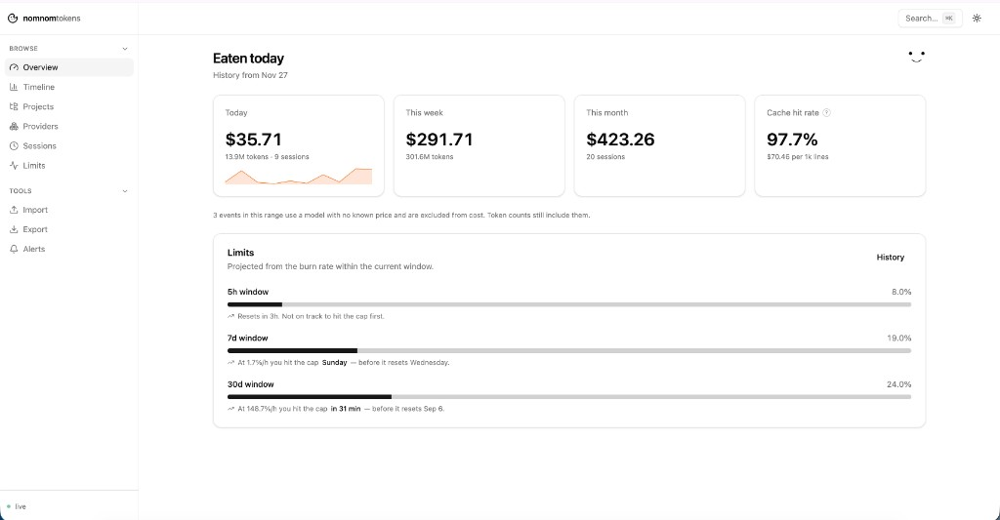
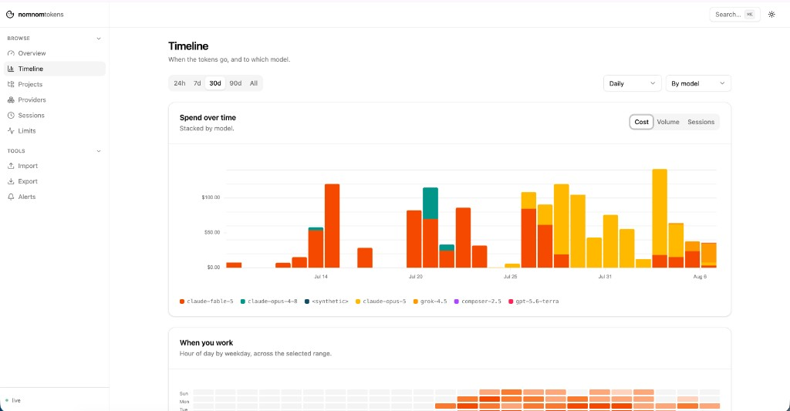

# nomnomtokens

> nom nom nom — your agents are eating tokens. One local store shows where.

A local-first dashboard for AI coding agent spend across Claude Code, Codex,
and Cursor. Run one command and a dashboard opens in your browser: how much
went today, on which projects and models, how much of that was cache or
subagents, and when you'll hit your limit.

```sh
npx nomnomtokens
```





One store for Claude Code, Codex CLI/IDE session rollouts, and Cursor (when its
local IDE database has token fields). The point is not another total — it is
history you can filter and audit: model mix, cache vs fresh tokens, and
subagent share where the transcript marks it. The event contract is deliberately
not AI-shaped, so other agents — and eventually CI minutes and cloud bills —
plug in as adapters without touching the core.

## What you get

- **Overview** — eaten today / this week / this month, a limits widget that
  projects when you'll hit the cap, a **Where it went** card (cache hit,
  subagent share, model mix, tips), and a **Verdict** when weekly limit
  snapshots exist.
- **Audit** — the full report: models, top sessions, cold resumes, tips. Same
  numbers as `nnt audit`.
- **Timeline** — spend over time stacked by model, plus an hour×weekday heatmap
  of when you actually work.
- **Projects** — per-project cost with trend against the preceding period. Click
  a row to filter every screen; expand a row to tag a client for invoices.
- **Providers** — per-agent and per-model breakdown: cache hit rate and cost per
  1,000 changed lines.
- **Sessions** — every conversation, drilling into how the bill accumulated.
- **Limits** — window-fill history with a burn-rate projection and markers for
  the moments you actually hit the cap.

Filter state lives in the URL, `⌘K` jumps anywhere, light or dark theme.

## Install

```sh
npx nomnomtokens          # scan history and open the dashboard
npx nomnomtokens init     # wire up the status line hook (limits + live updates)
```

`init` edits `~/.claude/settings.json` to add a `statusLine` entry. It backs the
file up first, refuses to clobber a status line you already have, and prints
exactly what it changed.

Why it matters: **subscription limits appear nowhere in the transcript.** The
5-hour and 7-day window percentages are only ever handed to the status line
hook. Without it you still get full history and cost; you don't get limits or
live updates.

The hook doubles as a real status line:

```
(＾ｕ＾)  $4.20  ctx 37%  7d 81% ·4d3h  5h 73% ·1h47m  138 lines
```

The countdown after each window is the time left until it resets: the
percentage tells you whether to slow down, the countdown tells you what slowing
down would cost. It is omitted when Claude Code sends no `resets_at`. The
weekly window is shown first when it is the tighter of the two. If Claude's
week is nearly full and a recent Codex snapshot in the store still has
headroom, a `codex 7d N%` suffix is appended.

## Commands

| Command | Does |
|---|---|
| `nnt` | scan, then open the dashboard |
| `nnt scan [--watch]` | read new records into the local store |
| `nnt serve [--port]` | open the dashboard |
| `nnt init [--force]` | wire up the status line hook |
| `nnt statusline` | ingest a session payload and print a status line |
| `nnt doctor` | why is it empty? checks sources, hook, store, and transcript wipe |
| `nnt import <file>` | billing CSV or nnt archive JSON into the local store |
| `nnt export` | dump filtered events as CSV/JSON, or `--format nnt` for a portable store |
| `nnt prices [show\|refresh]` | local model price table (`~/.nomnomtokens/prices.json`) |
| `nnt alerts [show\|check]` | limit % / daily $ thresholds (`~/.nomnomtokens/alerts.json`) |
| `nnt audit [--days] [--json]` | where spend went: cache, subagents, models, cold resumes, tips |
| `nnt verdict [--json]` | which Claude plan weekly fill actually needs (dated estimates) |
| `nnt otel --endpoint <url>` | opt-in OTLP/HTTP JSON export of numbers and hashes |

## Privacy

Your data never leaves your machine unless you opt in. No account, no telemetry.
The dashboard makes no outbound calls — not even a font or a CDN script. The
only network is explicit: `nnt prices refresh --from`, alert webhooks, and
`nnt otel --endpoint`.

The event type has nowhere to put a prompt, a diff, or a path:

```ts
scopeHash: string              // sha256(project path).slice(0, 16)
meta: Record<string, number>   // numbers only — no strings, by construction
```

Project paths are hashed; the readable label lives in a separate local table and
is never attached to an event. Full detail in
[docs/privacy.md](docs/privacy.md). Uninstalling is `rm -rf ~/.nomnomtokens`.

## Are the numbers right?

This turned out to be the hard part, and it's worth being explicit about,
because the obvious implementation over-reports by roughly **2.3×**.

1. **Claude Code writes the same turn several times.** On a 25k-line corpus,
   3,269 of 4,806 distinct turns appeared 2–3 times, identical apart from a
   per-record `uuid`. Dedup keys on `requestId` + `message.id`.
2. **Subagent spend is three directories deeper** than session transcripts, at
   `projects/<project>/<session>/subagents/`. A `projects/*/*.jsonl` glob
   silently drops every Task-tool subagent.
3. **There is no cost field any more.** Modern transcripts dropped `costUSD`, so
   cost is computed locally from the model and token counts. A model we can't
   price contributes `null`, never `0`, and the UI tells you how many events
   that was.

The scanner is reconciled against an independent implementation over the same
raw files, matching exactly on row count and all five token buckets. See
[docs/architecture.md](docs/architecture.md).

## Development

```sh
pnpm install
pnpm start        # build if needed, scan history, open the dashboard
pnpm dev          # Nuxt live reload only (no scan) on :4269
pnpm test         # unit tests
pnpm build        # Nuxt build, staged to web/, plus the bundled CLI in dist/
```

To check the published artefact rather than the workspace:

```sh
npm pack
cd $(mktemp -d) && npm init -y && npm i /path/to/nomnomtokens-0.1.0.tgz
./node_modules/.bin/nnt doctor
```

Layout: `packages/core` (types, pricing, aggregation — isomorphic, zero Node
API), `packages/db` (Drizzle + SQLite), `packages/adapters`, `packages/cli`,
`apps/web` (Nuxt 4 + Nitro).

The UI is Tailwind v4 with hand-written components that reproduce shadcn's
design tokens and variant recipes exactly — no component-library dependency.
Charts are [Unovis](https://unovis.dev), chosen because it styles from CSS
custom properties and so inherits the theme without a parallel config.

**Writing an adapter?** [docs/adapters.md](docs/adapters.md). A new source
should be a new directory and one line in the registry — if it needs a change to
the core, the contract is wrong and that's a bug worth reporting.

## Roadmap

Shipped: Claude Code / Cursor / Codex adapters, CSV and nnt-archive import &
export, Projects grouped by name with optional client tags, local `prices.json`
refresh, limit/daily alerts, all dashboard screens including `/audit`, limits
with forecasting, live updates, Overview audit + verdict, `nnt audit` /
`nnt verdict`, and opt-in `nnt otel`.

Cursor caveat: the IDE often stores zero token counts in local bubbles. We only
emit events when numbers are present (exact `tokenCount`, or
`tokensUsed` + delta). We do not estimate from message text. Sessions without
local counts will not appear until Cursor writes them — or until you import a
billing CSV.

Next: a desktop window and menu bar around the same local store. Cloud mode
stays a later second sink for the same events, never a rewrite, and never in
the critical path. An OTLP *receiver* is not on the roadmap — `nnt otel`
exports into Grafana/Datadog you already run.

## License

MIT
